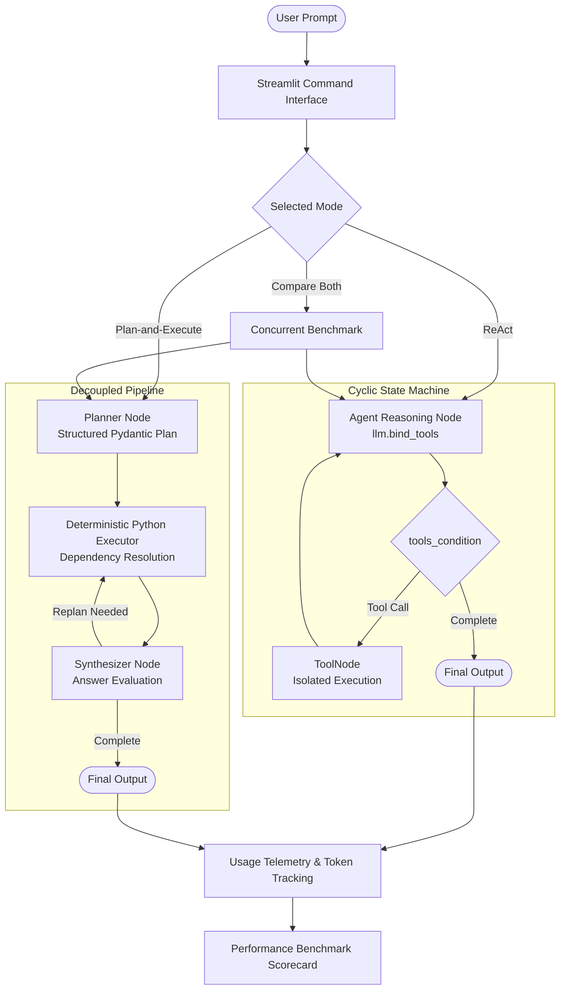

# Agent Arena: Autonomous Agent Architecture & Evaluation Studio

[](https://www.python.org/)
[](https://langchain-ai.github.io/langgraph/)
[](https://streamlit.io/)
[](https://docs.pydantic.dev/)
[](https://openrouter.ai/)
[](https://tavily.com/)
[](https://opensource.org/licenses/MIT)

**Agent Arena** is a production-grade benchmarking studio and modular agent framework built with **LangGraph**, **LangChain**, and **Python**. It implements and benchmarks two distinct agent reasoning paradigms—**ReAct (Reason + Act)** and **Plan-and-Execute**—evaluating real-world trade-offs between dynamic cyclic reasoning and decoupled upfront planning across tool reliability, token amplification, and execution latency.

---

## Key Highlights

- **Dual LangGraph Architectures:**
  - **ReAct Workflow:** Cyclic state machine implemented with `StateGraph` and `MessagesState`, featuring automated cycle routing (`tools_condition`) and recursion limits.
  - **Plan-and-Execute Workflow:** Decoupled 3-phase state graph (`PEState`) that produces a structured Pydantic plan upfront, executes tool steps deterministically, and dynamically synthesizes the final response with replanning budgets.
- **Dynamic Dependency Chaining:** Regex-based property evaluator (`{step_N_result.field}`) enabling downstream tools to consume earlier tool outputs (e.g. passing a live weather temperature directly into a calculator) in native Python with **zero intermediate LLM calls**.
- **Real-Time Streaming Studio:** Interactive **Streamlit** dashboard featuring live node-by-node execution updates via `st.status` and token-by-token typewriter answer streaming via `st.write_stream`.
- **Sandboxed Subprocess Execution:** `code_exec` tool running Python scripts in isolated temporary directories with configurable timeouts (1–30s) and automatic output truncation (8,000 chars) to prevent context blow-up.
- **Production-Grade Tool Suite:** Native integrations for live web search (**Tavily API**), deterministic arithmetic (**Calculator**), real-time weather forecasts (**Open-Meteo REST API**), and sandboxed computation (**Code Execution**).
- **Full Observability & Telemetry:** Instrumentation capturing prompt tokens, completion tokens, total token volume, model invocations, and wall-clock execution latency.
- **Side-by-Side Benchmarking:** Dedicated comparison mode that executes both architectures against identical prompts concurrently, generating head-to-head performance scorecards.

---

## System Architecture



### Execution Paradigms

1. **ReAct (Reasoning + Acting):**
   - Interleaves reasoning steps (`Thought`), function calls (`Action`), and environment feedback (`Observation`) in a continuous LangGraph cycle.
   - Highly adaptive: dynamically selects subsequent actions based on unexpected intermediate outputs.
   - Ideal for exploratory tasks, troubleshooting, and open-ended research queries.

2. **Plan-and-Execute:**
   - **Phase 1 (Plan):** Uses structured function calling (`Plan` schema) to produce an ordered list of tool steps upfront.
   - **Phase 2 (Execute):** Executes all tool steps sequentially in native Python, resolving step dependencies through regex placeholder substitution (`{step_1_result.field}`).
   - **Phase 3 (Synthesize & Replan):** Evaluates whether the objective is satisfied; triggers an additional plan phase if intermediate results were inconclusive.
   - Ideal for multi-step deterministic workflows, multi-tool pipelines, and cost-constrained tasks.

---

## Architectural Trade-Offs & Findings

Benchmarking both architectures reveals distinct operational trade-offs:

| Evaluation Dimension | ReAct Architecture | Plan-and-Execute Architecture |
|:---|:---|:---|
| **Graph Pattern** | Cyclic loop: `Thought -> Action -> Observation` | Linear 3-phase graph: `Plan -> Execute -> Synthesize` |
| **LLM Call Volume** | **O(N)** — 1 LLM call per reasoning iteration | **O(1) to O(R)** — Typically 2 calls (Planner + Synthesizer) |
| **Token Consumption** | Accumulates full conversation history on every step | Context isolated: tool execution runs in Python with 0 LLM tokens |
| **Latency Profile** | Low time-to-first-tool; latency scales with turns | Higher initial latency (planning), fast execution phase |
| **Failure Recovery** | Dynamic: agent adapts immediately to error outputs | Structured: synthesizer evaluates output and triggers extra plan steps |
| **Ideal Use Case** | Exploratory queries, dynamic branching, debugging | Predictable multi-step workflows, ETL pipelines, token-budgeted jobs |

### Core Architectural Insights

1. **Prompt Token Amplification in ReAct:**
   - On multi-step workflows, **ReAct accumulates prompt tokens quadratically**. Because the entire conversation history, tool definitions, and intermediate observations are re-sent on every single turn, prompt token consumption grows rapidly with task depth.
2. **Decoupled Efficiency in Plan-and-Execute:**
   - **Plan-and-Execute maintains near-constant prompt overhead**. Once the initial plan is generated, intermediate tool executions (like Python scripts or calculator operations) run in native Python without querying the LLM, reducing prompt token usage by up to **40–70%** on multi-step workflows.
3. **Latency Characteristics:**
   - ReAct achieves lower time-to-first-tool on straightforward single-step queries since it dispatches tool calls on turn 1 without an upfront planning phase.
   - Plan-and-Execute excels on complex tasks where upfront planning prevents circular tool loops and minimizes total round trips.

---

## Tool Ecosystem

All tools adhere to strict schemas, validate arguments, and return structured dictionaries with isolated error handling:

| Tool | Capability | Description |
|:---|:---|:---|
| [`code_exec`](tools.py) | Python Sandbox | Executes Python scripts via subprocess in an isolated temporary directory. Enforces execution timeouts (1–30s) and truncates output exceeding 8,000 characters. |
| [`search`](tools.py) | Live Web Search | Queries the Tavily Search API with basic search depth, returning structured titles, URLs, snippets, and relevance scores. |
| [`calculator`](tools.py) | Deterministic Math | Evaluates arithmetic operations (`add`, `subtract`, `multiply`, `divide`) with division-by-zero protection. |
| [`get_weather`](tools.py) | Meteorological Data | Geocodes city names and fetches live temperature, wind speed, and conditions via the Open-Meteo REST API. |

---

## Tech Stack

- **Language:** Python 3.13+ (managed via `uv`)
- **Agent Orchestration:** LangGraph, LangChain (`ChatOpenAI`, `StructuredTool`)
- **Web UI:** Streamlit (Obsidian Slate Theme, real-time response streaming)
- **Schema Validation:** Pydantic v2
- **LLM Gateway:** OpenRouter API (Claude 3.5 Sonnet, Gemini 2.0 Flash, Llama 3.3, Ling)
- **External Services:** Tavily Search API, Open-Meteo Weather API
- **Sandbox Environment:** Python `subprocess` with tempdir isolation and timeout protection

---

## Project Structure

```text
REACT_Agent/
├── app.py              # Streamlit evaluation studio with real-time response streaming
├── agents.py           # LangGraph agent workflows (ReAct & Plan-and-Execute)
├── tools.py            # Isolated tool implementations & registry (code_exec, search, etc.)
├── schemas.py          # Pydantic schemas (PlanStep, Plan, Synthesis) & Usage tracking
├── execution.py        # Plan execution engine, step resolver & dependency evaluator
├── prompts.py          # System prompts for ReAct, Planner, and Synthesizer
├── llm.py              # OpenRouter ChatOpenAI client factory
├── config.py           # Environment variables and application configuration
├── main.py             # Entrypoint runner for launching the application
├── pyproject.toml      # Project metadata & dependencies (uv/pip)
├── requirements.txt    # Frozen dependency list
└── .env.example        # Environment variable template
```

---

## Getting Started

### 1. Prerequisites
- Python 3.13 or higher
- [uv](https://github.com/astral-sh/uv) (recommended) or standard `pip`

### 2. Installation

Clone the repository and install dependencies:

```bash
git clone https://github.com/AYadav06/Agent_Arena
cd REACT_Agent
uv sync
```

*Or using standard pip:*
```bash
python -m venv .venv
source .venv/bin/activate      # On Windows: .venv\Scripts\activate
pip install -r requirements.txt
```

### 3. Environment Configuration

Copy the template file to `.env` and set your API keys:

```bash
cp .env.example .env
```

```env
# OpenRouter API key for LLM inference (required)
OPENROUTER_API_KEY=your_openrouter_api_key_here

# Tavily API key for live web search (required for search tool)
TAVILY_API_KEY=your_tavily_api_key_here

# Default model identifier
MODEL=inclusionai/ling-3.0-flash-vl:free
```

### 4. Launch the Evaluation Studio

Start the Streamlit dashboard:

```bash
uv run streamlit run app.py
```

*Or run via the main entrypoint:*
```bash
python main.py
```

Open **`http://localhost:8501`** in your browser to:
- Select between **ReAct**, **Plan-and-Execute**, or **Compare Both** directly in the command bar.
- Inspect live step-by-step reasoning progress and token-by-token typewriter response streaming.
- Benchmark latency, token volumes, LLM call counts, and structured tool traces side-by-side.

---

## Streamlit Cloud Deployment & Recruiter Access

When deploying to [Streamlit Community Cloud](https://share.streamlit.io), recruiters and reviewers can access the application without entering any API keys:

1. **Deploying with Server Secrets (Live Execution):**
   In your Streamlit Cloud app dashboard, navigate to **App Settings** -> **Secrets** and paste:
   ```toml
   OPENROUTER_API_KEY = "sk-or-v1-..."
   TAVILY_API_KEY = "tvly-..."
   MODEL = "google/gemini-2.0-flash-001"
   ```
   - Streamlit Cloud securely encrypts your keys server-side.
   - Any visitor or recruiter accessing your public URL will immediately be able to run live multi-step queries without being prompted for keys.
   - Credentials remain completely hidden from the browser frontend and are never exposed in Git.

2. **Built-in Zero-Config Showcase Mode:**
   - If no API key is provided, the platform automatically switches to **Showcase Mode**.
   - Recruiters can evaluate all pre-configured benchmark tasks (Tokyo meteorological queries, Fibonacci calculations, 2024 Nobel discoveries) across **ReAct**, **Plan-and-Execute**, and **Head-to-Head Comparison**.
   - Preserves complete live node status animations, tool execution outputs, and token/latency scorecard telemetry without consuming API credits or risking deployment crashes.

---

## Sample Telemetry & Trace Output

Every agent invocation returns a fully observable structured payload:

```json
{
  "success": true,
  "mode": "plan_execute",
  "query": "What is the weather in Tokyo right now and what is that temperature multiplied by 2?",
  "answer": "The current temperature in Tokyo is 24.3°C. Multiplied by 2, that gives 48.6.",
  "plan": [
    {
      "id": 1,
      "tool": "get_weather",
      "args_json": "{\"city\": \"Tokyo\"}",
      "description": "Get current weather forecast for Tokyo"
    },
    {
      "id": 2,
      "tool": "calculator",
      "args_json": "{\"operation\": \"multiply\", \"a\": \"{step_1_result.temperature}\", \"b\": 2}",
      "description": "Multiply Tokyo temperature by 2"
    }
  ],
  "trace": [
    {
      "step": 1,
      "tool": "get_weather",
      "args": "{\"city\": \"Tokyo\"}",
      "description": "Get current weather forecast for Tokyo",
      "observation": {
        "success": true,
        "city": "Tokyo",
        "temperature": 24.3,
        "unit": "celsius",
        "windspeed": 11.6
      }
    },
    {
      "step": 2,
      "tool": "calculator",
      "args": "{\"operation\": \"multiply\", \"a\": 24.3, \"b\": 2}",
      "description": "Multiply Tokyo temperature by 2",
      "observation": {
        "success": true,
        "expression": "multiply",
        "result": 48.6
      }
    }
  ],
  "usage": {
    "prompt_tokens": 1093,
    "completion_tokens": 4377,
    "total_tokens": 5470,
    "llm_calls": 2,
    "elapsed": 14.85
  },
  "error": null
}
```


## License

MIT License. See [LICENSE](LICENSE) for details.
